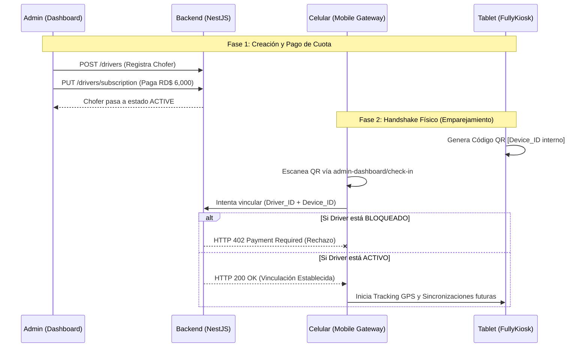
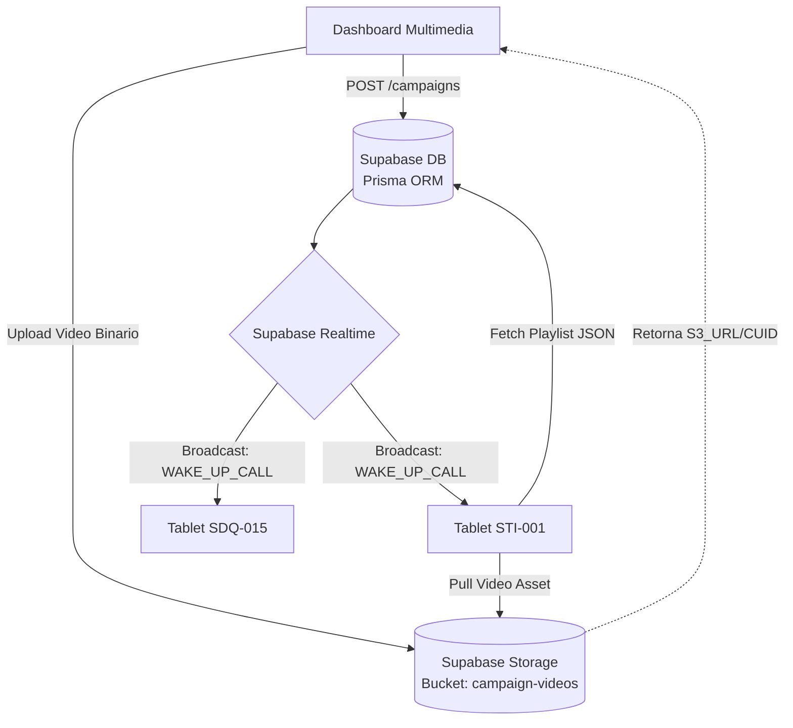
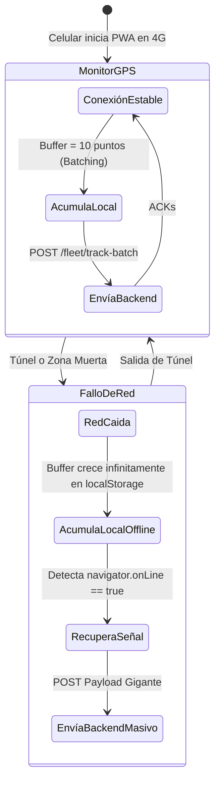
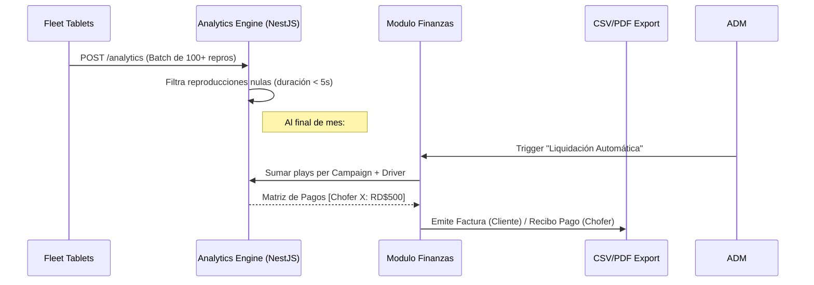

# TAD DOOH Platform: Flujo Operativo Estándar (SOP)

**Versión:** 1.6 (Auditoría v6.7.0 - SRE Approved)
**Última Actualización:** 04 de Abril, 2026 (05:55)

> ⚠️ Creado bajo el escrutinio de resiliencia y monitoreo obsesivo. Cualquier flujo manual que escape a este diagrama de arquitectura se considerará una vulnerabilidad crítica. El ciclo de vida de un anuncio debe ser predecible, determinista y auditable.

## 📍 CICLO DE VIDA DEL ANUNCIO Y OPERACIÓN DEL TAXI

El ecosistema se abstrae en 5 fases de alta disponibilidad, desde que ingresamos un conductor al sistema hasta que se emite la factura del anunciante. Todo ocurre en red, excepto cuando ocurre lo inevitable en RD (túnel 27 de febrero = 100% *Packet Loss*).

---

### Fase 1 & 2: Registro Inicial y Emparejamiento de Hardware (Onboarding)

El "Mobile Gateway" (celular del conductor con 4G) da vida a la tablet en el cabezal del asiento. La tablet es una tumba de hierro (`FullyKiosk`) aislada que depende del escaneo QR inicial para autenticarse.

---

### Fase 3: Distribución del Contenido (El Proceso de "Inyección")

No subimos blobs de datos por el backend. Eso estrangularía un backend de 512MB RAM en Easypanel. Usamos "Direct Uploads" y luego asignamos apuntadores de medios.

---

### Fase 4: Operación en Calle (Resiliencia Extrema / Offline-First)

El conductor viaja y su celular manda coordenadas. Si pierde conexión, hacemos "Batching". El backend NUNCA se inunda con peticiones unitarias de 100 taxis (reducción de I/O de red del 98%).

**Si la Respuesta del Backend al Celular es `HTTP 402` (Mora de pago):**
El celular (Gateway) ejecuta la directiva **Kill-Switch**: La PWA destruye su Worker GPS y la pantalla advierte al pasajero/taxista.

---

### Fase 5: Cierre Financiero Implacable (Auditoría/Liquidación)

Para evitar fraudes o discrepancias de "anuncios emitidos", liquidamos la nómina basados en impresiones efectivas.

1. **El Motor:** La base de datos agrupa `AnalyticsEvent` (`playback_complete`).
2. **Cáculo a Chofer:** `COUNT(campaign_id)` $\times$ `RD$500` (con techo máximo de 15 slots = RD$7,500).
3. **Cálculo a Marca:** Subtotales $\times$ ITBIS 18% vía generador PDF.

---

## 🛠️ PARCHES DE SRE ESTABLECIDOS

* [x] **Timeout Limits**: Las transferencias multimedia ahora expiran a los 300s en Vercel/Easypanel.
* [x] **Batching GPS 10:1**: Prohibidas las llamadas HTTP individuales desde el celular.
* [x] **CORS Asesino**: El Header `x-device-id` ha sido bluelisted globalmente para evitar caídas en el handshake entre la app móvil y el gateway de NestJS.
