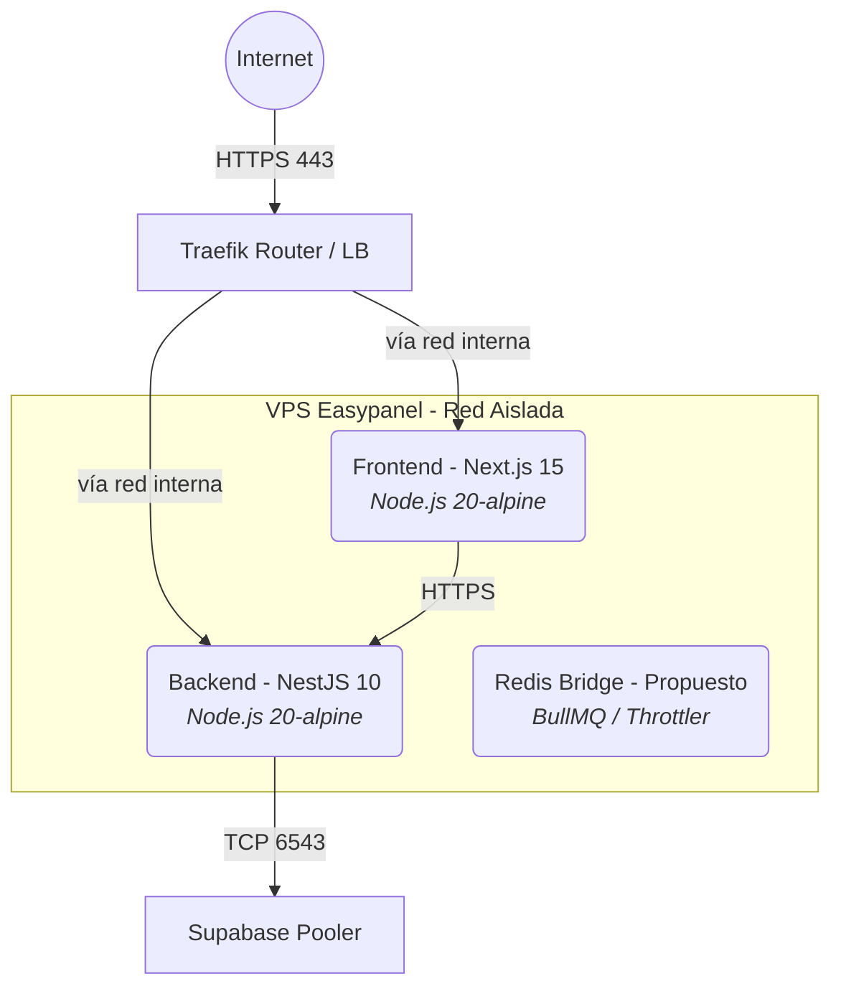

# 🏗️ 05 — BLUEPRINT DE INFRAESTRUCTURA (DOCKER / EASYPANEL)

> **Propósito**: Estandarizar el ciclo de despliegue, asignación de recursos y resiliencia de contenedores en el VPS.
> **Audiencia**: DevOps, SRE, Lead Architects.
> **Estado Operativo**: 🔴 REQUIERE AJUSTES URGENTES EN LÍMITES DE MEMORIA.

---

## 🏗️ 1. TOPOLOGÍA DE RED Y CONTENEDORES

El sistema se ejecuta sobre **Easypanel** en un VPS restringido. Es crítico no dejar que Next.js (SSG/ISR) o NestJS (V8 Garbage Collector) devoren la memoria del host.



## ⚙️ 2. CONFIGURACIÓN DE CONTENEDORES (DOCKER-COMPOSE / NIXPACKS)

La construcción actual vía Nixpacks/Vercel es permisiva. En un entorno Dockerizado de producción (Easypanel), **DEBEMOS asfixiar los recursos** para obligar a Node.js a realizar Garbage Collection agresivamente y evitar *OOM Kills* sorpresivos.

### 2.1 Backend (NestJS 10)

NestJS es un framework pesado en inyección de dependencias. Una fuga en Prisma puede liquidar el VPS.

* **Estrategia RAM:** `max_old_space_size=256` limita el Heap de V8 a 256MB.
* **Healthcheck:** Vital para reiniciar el nodo si Prisma agota el pool de conexiones.

```yaml
services:
  tad-api:
    image: tad-api:latest
    deploy:
      resources:
        limits:
          memory: 512M # Límite estricto de Docker
          cpus: '0.5'
    environment:
      - NODE_ENV=production
      - NODE_OPTIONS="--max_old_space_size=256"
      - DATABASE_URL=${DATABASE_URL}
      - DIRECT_URL=${DIRECT_URL}
      - PRISMA_CLIENT_ENGINE_TYPE=library
    healthcheck:
      test: ["CMD", "curl", "-f", "http://localhost:3000/api/health"]
      interval: 30s
      timeout: 5s
      retries: 3
    restart: unless-stopped
```

### 2.2 Frontend (Next.js 15)

Next.js tiene un historial nefasto de *memory leaks* durante el enrutado dinámico e ISR.

```yaml
services:
  tad-dashboard:
    image: tad-dashboard:latest
    deploy:
      resources:
        limits:
          memory: 512M
          cpus: '0.5'
    environment:
      - NODE_ENV=production
      - NEXT_TELEMETRY_DISABLED=1
      - NODE_OPTIONS="--max_old_space_size=256"
      - NEXT_PUBLIC_API_URL=https://tad-api.dominio.com/api
    healthcheck:
      test: ["CMD", "curl", "-f", "http://localhost:3000/"]
      interval: 60s
      timeout: 10s
      retries: 3
    restart: unless-stopped
```

## 🔒 3. GESTIÓN DEL ENTORNO Y SECRETOS

No expongas credenciales en `.env` trackeados por Git. Esto es nivel 1 de seguridad pero el código auditado sugiere lo contrario. Easypanel cuenta con gestión de secretos:

1. `DATABASE_URL` (Pooler, PgBouncer, 6543) -> Solo usado por NestJS (Prisma).
2. `DIRECT_URL` (Directo, 5432) -> Exclusivo para el paso de build de Nixpacks (`npx prisma migrate deploy`).
3. `SUPABASE_SERVICE_ROLE_KEY` -> Token JWT con rol de infraestructura. **CUIDADO**: Darle esto al frontend es firmar la sentencia de muerte del sistema.

## ⚠️ 4. OBSERVABILIDAD Y FUGAS (SRE AUDIT)

Tras revisar el stack, aquí están las pesadillas inminentes si no se configuran límites:

1. **Fuga de Prisma Connections**: Si `app.enableShutdownHooks()` no está activo en `main.ts` de NestJS, cada vez que Easypanel re-despliega el contenedor por un cambio, las conexiones a Supabase se quedan zombie.
2. **Buffer de subida de Videos**: Subir un archivo de 200MB cargará ese archivo en memoria RAM del contenedor backend si usamos `FileInterceptor` estándar. Con un límite de 512MB RAM, un subidón de 2 videos concurrentes matará el contenedor (OOM).
   * **Solución Obligatoria**: Usar `Direct-to-Supabase Storage` desde el browser (Frontend -> Supabase), y luego enviar el CUID/URL al backend. ¡NO pasar el binario del video por NestJS!
