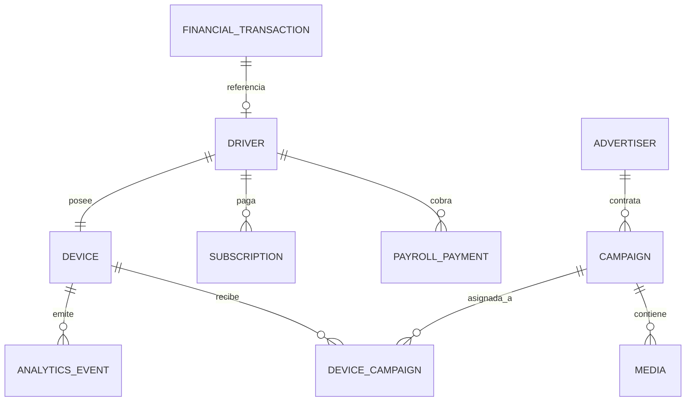

## 🗄️ Esquema Geométrico de Datos (Entidades y Relaciones)

La plataforma TAD DOOH utiliza una base de datos relacional (PostgreSQL) gestionada a través de **Prisma ORM**. Este documento detalla los pilares estructurales que permiten la operación de la red publicitaria.

### 🏗️ Entidades de Hardware y Personal

#### **1. Devices (Tablets)**

Es el corazón técnico. Representa la unidad física (Kiosk) montada en el taxi.

- **Relaciones Clave:** Vinculada a un `Driver` (1:1), posee múltiples `AnalyticsEvents` y `PlaybackEvents`.
- **Estados Críticos:** `isOnline`, `batteryLevel`, `storageUsed`, `lastHeartbeat`.
- **Dato Maestro:** El `deviceId` es la llave única de hardware (Ej: `taxi-1234`).

#### **2. Drivers (Conductores)**

Representa al socio comercial.

- **Relaciones Clave:** Tiene un `Device` asignado, una `Subscription` activa y recibe pagos de `PayrollPayment`.
- **Atributos:** WhatsApp/Phone, Placa del taxi, Estado de suscripción pagada.
- **Sistema de Referidos:** Soporta una estructura jerárquica de conductores que refieren a otros.

---

### 🎞️ Entidades de Publicidad (Inventory)

#### **3. Campaigns (Campañas)**

La pauta comercial contratada por las marcas.

- **Geocercado:** Atributos como `targetCities`, `isGlobal`.
- **Targeting por Dispositivo:** Relación M:M con `Device` a través de `DeviceCampaign`.
- **Media:** Contiene múltiples archivos de video/imagen (`Media`, `MediaAsset`).

#### **4. Media & MediaAssets**

Los archivos binarios (.mp4, .jpg) que se reproducen.

- **Versatilidad:** Soportamos dos tablas de medios por transición arquitectónica (`Media` v2 y `MediaAsset` v1).
- **Atributos:** Duración en segundos, `qrUrl` para escaneos, `url` (Supabase Storage).

---

### 💰 Entidades Financieras (Ledger)

#### **5. Subscriptions (Membresías)**

El cobro de mantenimiento de RD$6,000.

- **Lógica:** Vincula un `Driver` con su periodo de gracia/validez. Si expira (`valid_until`), el sistema emite un error `402` al player.

#### **6. FinancialTransactions (Libro Mayor)**

Registro contable inmutable de todo el dinero que entra y sale.

- **Categorías:** `SUSCRIPCION`, `PUBLICIDAD`, `REFERIDOS`, `SERVER`.
- **Cálculo:** Almacena `amount` (Bruto), `taxAmount` (18% ITBIS) y `netAmount`.

---

### 🛰️ Entidades de Telemetría (Analytics)

#### **7. AnalyticsEvents & PlaybackEvents**

Log de actividad cruda desde los taxis.

- **AnalyticsEvent:** Errores de sistema, descargas de video, cambios de estado.
- **PlaybackEvent:** **CADA VEZ** que un video termina de reproducirse, se guarda con `lat` y `lng` exactos para el reporte de impacto del anunciante.

#### **8. DriverLocations**

Historial GPS para el dibujo de estelas (Glow Trails) y mapas de calor.

---

### 🔄 Mapa de Relaciones (Mermaid)

