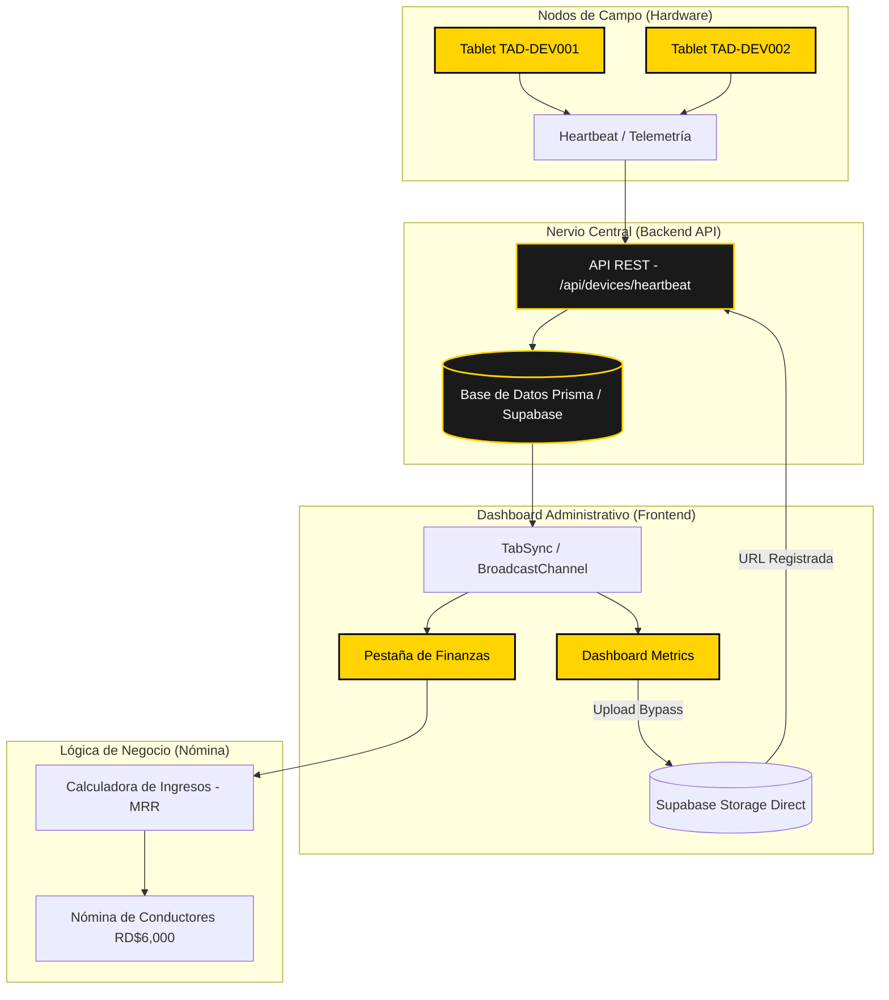

## 🏗️ Arquitectura Estructural de Datos

Este documento detalla el viaje de la información desde que una Tablet de la prueba de **10 socios** entra en funcionamiento hasta que se refleja en el **Dashboard** y la **Nómina**.

### 🗺️ Mapa de Flujo (Mermaid Diagram)

### 🚦 Puntos de Control Criticos para la Prueba 10x10

#### 1. El Latido (Heartbeat)

Cada tablet de la prueba envía una señal cada **30 segundos**.

- **Si el dato llega**: El Dashboard muestra la unidad como `ONLINE`.
- **Si falla**: El Radar de Detalles (Obsidian) lanzará una alerta en 5 min.

#### 2. Sincronización de Pestañas (TabSync)

Gracias a la mejora del `BroadcastChannel`, si abres la pestaña de **Conductores** y la de **Finanzas**:

1. Al registrar un driver en una ventana.
2. La señal viaja por el canal local.
3. El Dashboard se recalcula **sin refrescar la página**. ✨

#### 3. Upload Bypass (Supabase P2P)

Los videos publicitarios (ej. +200MB) **NUNCA** pasan por el backend en NestJS. El Dashboard obtiene una "URL Firmada" y sube temporalmente a Supabase Storage y sólo cruza metadata al final. *Node.js nunca colapsa de RAM.*

#### 4. Tolerancia a Fallos (Tablets)

Si una tablet (TAD-DEV) pierde red por más de XX horas o entra a un túnel, entra en modo **Cache-First** persistiendo en `localStorage` las campañas activas. Si debe cobro (402), despliega un alert box (`TAD_UI_TOAST`).

#### 3. Integridad de Hardware

- **Restricción**: Un Conductor NO puede existir sin una Tablet vinculada. El sistema ahora valida esto proactivamente.

---
> [!IMPORTANT]
> **Arismendy**: Este diagrama es interactivo dentro de Obsidian. Si ves que el flujo no es el esperado en alguna tablet, busca el punto de falla en este mapa.
