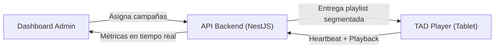
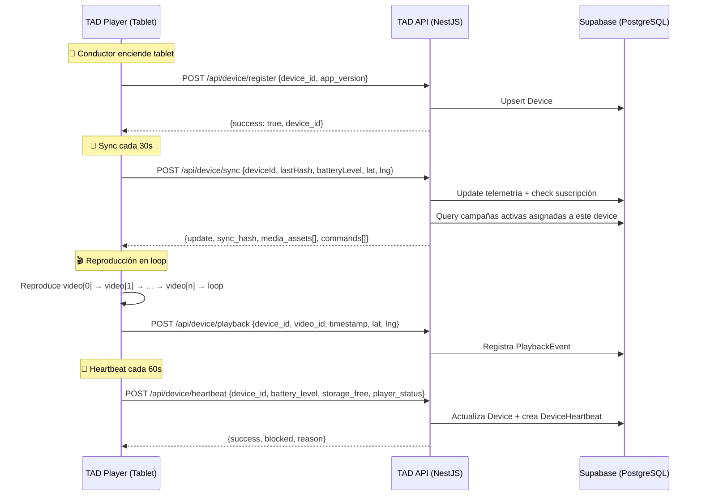
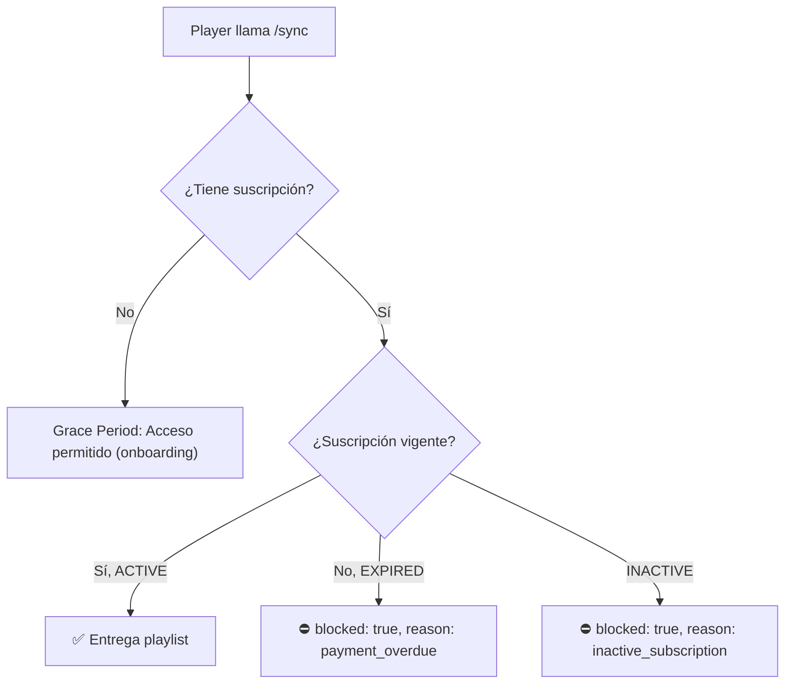

# TAD Player — Arquitectura, Lógica de Segmentación y Guía de Onboarding

## 1. Visión General

TAD Player es el reproductor de contenido publicitario instalado en tablets Android dentro de los taxis. Su función es **recibir, almacenar y reproducir videos publicitarios** asignados de forma segmentada desde el Dashboard de control (Admin Console).



---

## 2. Flujo de Comunicación Player ↔ API

### 2.1 Ciclo de Vida Completo



---

## 3. Lógica de Segmentación de Contenido

### 3.1 ¿Cómo llega contenido específico a pantallas específicas?

El sistema usa **3 niveles de segmentación**:

| Nivel | Método | Ejemplo |
|-------|--------|---------|
| **Global** | `campaign.targetAll = true` | "Promo Nacional Presidente" → llega a **todas** las 100 pantallas |
| **Regional** | `campaign.targetCity = "Santiago"` | "Promo Santiago" → solo pantallas STI (30 pantallas) |
| **Manual** | Tabla `DeviceCampaign` | Asignar manualmente desde Dashboard a pantallas específicas (ej: SDQ0001, SDQ0005) |

### 3.2 Query de Segmentación (Backend)

Cuando una pantalla llama a `POST /api/device/sync`, el backend ejecuta:

```sql
-- Simplificado: busca campañas activas para ESTE device
SELECT * FROM campaigns
WHERE active = true
  AND start_date <= NOW()
  AND end_date >= NOW()
  AND (
    target_all = true                                    -- Campaña Global
    OR id IN (SELECT campaign_id FROM device_campaigns   -- Asignación manual
              WHERE device_id = 'uuid-del-device')
  )
```

### 3.3 Límite de 15 Slots por Pantalla

Cada pantalla tiene **máximo 15 espacios publicitarios** (slots de ~30 segundos cada uno = ciclo de ~7.5 minutos). Este límite se valida en:

- **Asignación**: `CampaignService.assignCampaignToDevice()` rechaza si ya tiene 15
- **Sync**: `CampaignService.getActiveSyncVideos()` trunca a 15 con `.slice(0, 15)`
- **Dashboard**: Endpoint `GET /api/device/:id/slots` muestra ocupación visual

### 3.4 Delta Sync (Optimización de Ancho de Banda)

Para evitar descargar la misma playlist repetidamente:

1. El backend calcula un **hash MD5** de todos los `media_asset.id + checksum` combinados
2. El Player envía su `lastHash` guardado en localStorage
3. Si coinciden → respuesta `{update: false}` (sin transferir datos)
4. Si difieren → envía la playlist completa con URLs de descarga

---

## 4. Endpoints de la API (Para el Player)

| Endpoint | Método | Descripción | Auth |
|----------|--------|-------------|------|
| `/api/device/register` | POST | Registra pantalla nueva en la red | Público |
| `/api/device/heartbeat` | POST | Reporta estado (batería, almacenamiento) | Público |
| `/api/device/sync` | POST | Obtiene playlist segmentada + comandos | Guard Suscripción |
| `/api/device/playback` | POST | Confirma reproducción de un video | Público |
| `/api/device/:id/slots` | GET | Consulta ocupación de slots | Público |
| `/api/device/command/:id/ack` | POST | Confirma ejecución de comando remoto | Público |

### 4.1 Payload de Sync (Respuesta Exitosa)

```json
{
  "update": true,
  "blocked": false,
  "sync_hash": "a1b2c3d4e5f6...",
  "campaign_version": 1711000000000,
  "media_assets": [
    {
      "id": "uuid",
      "campaignId": "camp-sti-2026",
      "type": "VIDEO",
      "filename": "promo-santiago.mp4",
      "url": "https://supabase-storage.../promo-santiago.mp4",
      "fileSize": 5242880,
      "checksum": "md5hash...",
      "duration": 30,
      "version": 1
    }
  ],
  "commands": [
    {
      "id": "cmd-uuid",
      "type": "REBOOT",
      "params": {}
    }
  ]
}
```

---

## 5. Sistema de Suscripción (Guard)

Cada pantalla requiere una suscripción activa (RD$6,000/año) para recibir contenido:



---

## 6. Comandos Remotos

Desde el Dashboard, el admin puede enviar comandos que el Player recoge en su próximo sync:

| Comando | Descripción |
|---------|-------------|
| `REBOOT` | Reinicia el equipo |
| `CLEAR_CACHE` | Limpia contenido almacenado |
| `FORCE_SYNC` | Fuerza descarga inmediata |
| `UPDATE_URL` | Cambia URL del Player |

---

## 7. Guía de Configuración para Nuevos Conductores

### Paso 1: Preparar la Tablet

**Requisitos mínimos:**
- Tablet Android 8.0+ con pantalla 10"
- Almacenamiento libre: mínimo 2 GB
- Conexión WiFi o Datos Móviles

### Paso 2: Instalar Fully Kiosk Browser

1. Descargar desde [fully-kiosk.de](https://www.fully-kiosk.de/) (~$8 USD licencia única)
2. Instalar el APK en la tablet
3. Abrir Fully Kiosk y aceptar todos los permisos

### Paso 3: Configurar Fully Kiosk

```
Settings → Web Content:
├─ Start URL: https://tad-player.easypanel.host?deviceId=STI0001
├─ Load URL on App Start: ON
└─ Enable JavaScript: ON

Settings → Kiosk Mode:
├─ Start on Boot: ON
├─ Keep Screen On: ON
├─ Disable Status Bar: ON
└─ Disable Navigation: ON

Settings → Remote Administration:
├─ Enable Remote Administration: ON
└─ Password: [contraseña del equipo]
```

> **IMPORTANTE:** El parámetro `?deviceId=STI0001` en la URL es **obligatorio**. Sustituir por el código real de la pantalla asignada a este conductor (ej: `SDQ0012`, `PUJ0003`).

### Paso 4: Registrar Conductor en el Dashboard

1. Acceder al Dashboard → **Conductores y Suscripciones**
2. Click **"Registrar Nuevo"**
3. Llenar formulario:
   - Nombre completo del conductor
   - Cédula
   - Teléfono (WhatsApp)
   - Placa del vehículo
   - Placa del taxi
   - **ID de Pantalla** (ej: `STI0001`)
4. Guardar

### Paso 5: Vincular Pantalla a Campaña

1. Dashboard → **Campañas** → Seleccionar la campaña deseada
2. En la sección **"Pantallas Asignadas"**, click **"Vincular Hardware"**
3. Seleccionar la pantalla del conductor (ej: `STI0001`)
4. Confirmar asignación

### Paso 6: Verificar Conexión

1. Encender la tablet en el taxi
2. Esperar **30 segundos** (el Player hace sync automático)
3. En el Dashboard → **Monitoreo de Flota**, verificar que la pantalla aparece como **ONLINE** (indicador amarillo ⚡)
4. Verificar que los videos comienzan a reproducirse

### Paso 7: Montar Físicamente

1. Instalar soporte de tablet en la parte trasera del asiento del copiloto
2. Conectar el cargador de tablet al encendedor del vehículo (12V)
3. Asegurar que los cables no interfieran con el conductor
4. Verificar que la pantalla sea visible para los pasajeros

---

## 8. Convenciones de IDs por Ciudad

| Ciudad | Código | Ejemplo | Rango |
|--------|--------|---------|-------|
| Santo Domingo | SDQ | SDQ0001 - SDQ0040 | 40 pantallas |
| Santiago | STI | STI0001 - STI0030 | 30 pantallas |
| Punta Cana | PUJ | PUJ0001 - PUJ0020 | 20 pantallas |
| Puerto Plata | POP | POP0001 - POP0010 | 10 pantallas |

---

## 9. Troubleshooting Rápido

| Problema | Solución |
|----------|----------|
| Pantalla muestra "Esperando asignación" | Verificar que la campaña esté ACTIVA y asignada a esta pantalla en el Dashboard |
| Player dice "BLOQUEADO" | Verificar suscripción del conductor en Dashboard → Conductores |
| Video no carga | Verificar conexión a internet y que la URL del video sea accesible |
| Pantalla aparece OFFLINE en Dashboard | Verificar conexión WiFi/datos de la tablet, reiniciar Fully Kiosk |
| Sin contenido después del sync | Verificar que hay campañas activas con media assets subidos |
